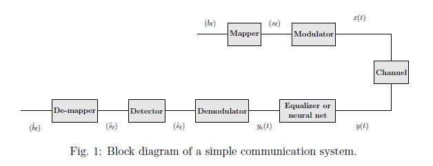

# Deep-Learning-for-solving-NLS-in-Telecommunication
Deep Learning models to solve the **Nonlinear Schrödinger equation** for Telecommunication problem.

* Models implemented from scratch.
* Models implemented with Tensorflow.

# Data generation

In this problem, we don't have a specific dataset in the wild, what we can do is to simulate the channel and generate the dataset for training and testing.

You can generate as much as you want of the data with the notebook **Data Generator.ipynb**.

# Train a model

After generating enough data, (arround 100k examples), you can play arround with multiple architectures. We found that an **denosing autoencoder** like network gives the best results.
